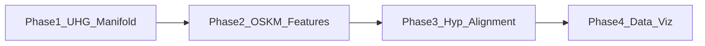

# Project Plan: C2S-Scale-Gemma + Yamanaka Trajectory

This document is the **reprogramming / trajectory roadmap** for evolving the C2S-Scale-Gemma hybrid toward modeling cellular reprogramming with hyperbolic geometry. It complements the broader hybrid implementation notes in [`plan.md`](plan.md).

---

## Objective

Transform the C2S-Scale-Gemma hybrid architecture into a specialized tool for modeling **cellular reprogramming**. Use **Unified Hyperbolic Geometry (UHG)** to represent the non-Euclidean “climb” from differentiated somatic cells back toward **pluripotency**, with Yamanaka factors (OSKM) as primary structural signals.

---

## Phase 1: UHG Infrastructure and Manifold Setup

- **Lorentzian manifold:** Shift from purely Euclidean graph layers to UHG **Lorentz** or **Poincaré** manifold operations where the model stack allows it. These spaces are a good fit for exponential branching in differentiation hierarchies.
- **Hierarchical scaling:** Make hyperbolic curvature ($\kappa$) a **learnable** parameter so the space can stretch as trajectories move toward a stem-cell “root.”
- **Primary code touchpoint (intent):** evolve the HGNN stack to rely consistently on UHG manifold operations (e.g. hyperbolic linear / distance), not ad hoc Euclidean layers in the hyperbolic pathway.

---

## Phase 2: Yamanaka Factor Feature Engineering

- **Token prioritization:** Extend the Cell2Sentence / tokenizer path so **Yamanaka factors (OSKM)** behave as **anchor tokens** when building text views of cells.
- **Graph centrality:** In graph construction (kNN and/or GRN), assign **higher edge weights** to interactions involving **Oct4 (POU5F1), Sox2, Klf4, and c-Myc (MYC)**.
- **Synthetic perturbation:** Add a script that can **silence or overexpress** these factors in inputs to test whether hyperbolic embeddings move toward the expected “root” in embedding space.

---

## Phase 3: Trajectory Alignment (“Time Machine” Logic)

- **Loss function:** Implement **hyperbolic contrastive alignment** so LLM and graph branches align in **hyperbolic space**, not only with Euclidean cosine on projected vectors.
- **Curvature metrics:** Define a **pluripotency score** or **biological age proxy** from **hyperbolic distance** to a reference **embryonic stem cell (ESC)** cluster (or equivalent reference set), once defined in data.

---

## Phase 4: Validation and Benchmarking

- **Dataset:** Use public scRNA-seq of human fibroblasts undergoing **OKSM** reprogramming (e.g. **GSE103224** and related series) alongside current PBMC-style runs.
- **Visualization:** Use **hyperbolic UMAP** or the **uhg** visualization tooling to show trajectories. Target qualitative success: a **cone- or tree-like** structure with OSKM driving the main movement toward the root.

---

## Immediate Next Steps (Checklist)

- [ ] **Real validation datasets:** Run the named validation bundle workflow against the selected OKSM time-course datasets and record which profiles/thresholds need adjustment.
- [x] **Dataset readiness manifest:** Add a readiness report that connects validation tracks, dataset profiles, local data hints, and missing artifacts before expensive validation runs.
- [x] **Threshold calibration audit:** Add checks for heuristic window profiles and recommendation thresholds before treating validation outputs as calibrated.
- [x] **Validation preflight / artifact QA:** Add preflight checks for validation inputs and QA checks for exported artifact bundles before treating a run as review-ready.
- [x] **Interpretation-limit guardrails:** Carry explicit biological-claim limits into validation summaries, explorer payloads, and markdown reports.
- [x] **Real-run review protocol:** Add an ordered protocol manifest for readiness, calibration, preflight, bundle execution, artifact export, QA, and interpretation review.
- [x] **Manifold-readiness audit:** Add static reporting for Euclidean operations that must be reviewed before the HGNN stack is treated as manifold-native.
- [x] **Manifold refactor plan:** Convert readiness findings into staged implementation slices for encoder projections, HGNN layers, alignment geometry, and trainer embedding selection.
- [x] **UHG capability probe:** Report which UHG modules import cleanly so manifold-native layer work is gated by actual available operators instead of assumed APIs.
- [x] **Alignment backend transparency:** Expose whether alignment loss used projective UHG distance or a Euclidean fallback during geometry-aware runs.
- [x] **Validation backend reporting:** Carry geometry backend/fallback metadata from embedding comparisons into validation summaries and markdown reports.
- [x] **Trainer geometry source tracking:** Return alignment graph embeddings separately from fusion graph embeddings and report which graph representation each path consumed.
- [x] **Encoder tangent adapters:** Replace anonymous Euclidean projection maps in the UHG encoder with explicit tangent-space linear adapters.
- [x] **Layer tangent adapters:** Replace anonymous Euclidean feature maps in UHG GraphSAGE, GIN, and attention layers with explicit tangent-space adapters.
- [x] **Alignment tangent adapter:** Replace the alignment graph-dimension projection fallback with an explicit tangent-space adapter.
- [x] **Strict geometry backend option:** Add a config-driven fail-fast mode for projective/hyperbolic alignment when the UHG distance backend is unavailable.
- [x] **Primary manifold selection:** Centralize the configured validation/alignment manifold as `projective_uhg` so unsupported manifold names fail explicitly instead of mixing geometry assumptions silently.
- [x] **Readiness progress accounting:** Extend the manifold-readiness audit to report resolved tangent adapter coverage alongside remaining findings.
- [x] **Trajectory geometry artifact:** Export per-cell validation trajectory geometry distances alongside shared-PCA projection artifacts.
- [x] **Trajectory geometry summary:** Add compact mean/max geometry-distance summaries to validation benchmark artifacts.
- [x] **Explorer geometry summary:** Surface trajectory geometry summaries in validation explorer payloads and HTML.
- [x] **Validation data manifest:** Export accessions, source URLs, expected columns/timepoints, and local data targets for configured validation tracks.
- [x] **Regulatory pathway screening:** Add OSKM-adjacent pathway scoring helpers for PBMC/screening datasets before full biological interpretation.
- [x] **Regulatory screening report:** Add a CLI/report workflow for ranking candidate `.h5ad` datasets by OSKM-adjacent pathway activity.
- [x] **Regulatory candidate-cell selection:** Add a selection/export workflow for isolating high-signal cells from PBMC/screening datasets before root-finding stress tests.
- [x] **Dataset download plans:** Add inferred GEO supplementary download URLs/commands to validation data manifests for review before large downloads.
- [x] **Dataset inspection:** Add a downloaded-AnnData inspection report for obs columns, timepoints, cell types, and OSKM gene resolution before expensive validation.
- [x] **Dataset profile checks:** Compare inspection reports against named validation-track expectations before full bundle execution.
- [x] **Artifact review report:** Add a content-level review report for exported validation bundles covering interpretation limits, recommendation status, fallback geometry, risk signals, and trajectory geometry coverage.
- [ ] **Artifact review:** Use the one-command validation artifact export to review benchmark summaries, explorer HTML, shared trajectory projections, and cell-level trajectory deltas for real runs.
- [x] **HGNN / manifold layers:** Gate the manifold-native layer refactor against runtime UHG capabilities. Current environment imports `uhg.projective.ProjectiveUHG` for distance, while broader `uhg.layers`, `uhg.nn`, and `uhg.manifolds` imports fail; keep explicit tangent-space adapters until importable manifold-native layer ops are available.
- [x] **Alignment script / losses:** Update contrastive alignment to use the configured **projective-UHG distance** path for geometry-aware runs, with explicit backend/fallback and primary-manifold metadata instead of relying solely on `F.cosine_similarity`.
- [x] **Data prep (PBMC / screening):** Isolate cells that **share regulatory pathways** with Yamanaka factors to stress-test “root-finding” before full reprogramming series are treated as biological evidence.

## Progress So Far

- [x] Added compatibility layers so the dual-encoder training/evaluation stack works against a consistent API.
- [x] Centralized OSKM aliases and presence checks for human/mouse-style symbol resolution.
- [x] Added configurable OSKM anchor handling in the Cell2Sentence data path.
- [x] Added OSKM-aware graph reweighting for kNN builds.
- [x] Added in silico OSKM perturbation tooling and embedding-comparison workflows.
- [x] Added branch/risk overlays, partial reprogramming window heuristics, and longevity-safe-zone reporting.
- [x] Added config-driven reference labels, heuristic window profiles, and marker-panel scoring hooks for rejuvenation vs pluripotency risk.
- [x] Added a configurable geometry-aware alignment mode (`projective_distance`) alongside the Euclidean cosine baseline.
- [x] Added paired Euclidean-vs-projective ablation workflows, manifests, and safety/risk comparison plots for perturbation reports.
- [x] Added named validation tracks with expected timepoints, primary metrics, recommendation thresholds, and benchmark summaries.
- [x] Added validation explorer payloads, chart-ready trajectory series, and self-contained HTML explorer reports.
- [x] Added cell-level validation trajectory datasets with timepoint/branch cohorts and projective-vs-Euclidean cell deltas.
- [x] Added shared-PCA trajectory projection exports, branch/safe-zone projection plots, and an interactive projection HTML viewer.
- [x] Added a one-command validation artifact export workflow that emits the main benchmark, explorer, trajectory dataset, projection, and HTML artifacts together.
- [x] Added validation preflight checks and exported-artifact QA so real dataset runs fail early when inputs or outputs are incomplete.
- [x] Added validation dataset readiness reporting so tracks can be triaged as ready, missing data, or metadata-incomplete before model execution.
- [x] Added interpretation-limit metadata to validation outputs so heuristic model findings stay separated from biological safety claims.
- [x] Added calibration-audit reporting for heuristic window profiles and track-level recommendation thresholds.
- [x] Added validation review protocol manifests so real dataset runs have an explicit go/no-go review sequence.
- [x] Added manifold-readiness audit reports for identifying Euclidean operations on the geometry path before UHG refactoring.
- [x] Added manifold refactor plan exports so readiness findings become ordered implementation stages with success criteria.
- [x] Added UHG capability probes to manifold-readiness reports, making native-layer availability an auditable runtime fact.
- [x] Added alignment loss backend metadata so projective validation runs can report whether UHG distance or fallback distance was used.
- [x] Propagated geometry backend metadata into validation benchmark rows and markdown so fallback use remains visible in exported artifacts.
- [x] Added trainer graph-source metadata so validation artifacts can distinguish fusion embeddings from alignment embeddings.
- [x] Added explicit `TangentSpaceLinear` adapters for UHG encoder input/output and multi-scale fusion projections as a first encoder-path manifold refactor slice.
- [x] Added explicit `TangentSpaceLinear` adapters for UHG layer self/neighbor, MLP, and attention projections.
- [x] Added an explicit `TangentSpaceLinear` adapter for graph-to-geometry projection inside geometry-aware InfoNCE alignment.
- [x] Added `fusion.require_geometry_backend` so validation runs can reject Euclidean fallback distance for geometry-aware alignment.
- [x] Centralized the alignment manifold backend around `projective_uhg` and reject unsupported primary manifold names explicitly.
- [x] Added resolved-adapter counts to manifold-readiness reports so geometry refactor progress is visible in audit artifacts.
- [x] Added validation trajectory geometry-distance artifacts with backend/fallback metadata for per-cell baseline-to-perturbed movement.
- [x] Added compact trajectory geometry summaries to validation benchmark JSON and Markdown reports.
- [x] Added trajectory geometry summary tables to validation explorer payloads and self-contained HTML reports.
- [x] Added validation data manifests for dataset acquisition/review before real benchmark runs.
- [x] Added OSKM-adjacent regulatory pathway screening helpers to rank cells by shared regulatory activity.
- [x] Added regulatory screening report exports for candidate PBMC/screening datasets.
- [x] Added regulatory candidate-cell selection manifests and optional `.h5ad` subset export for high-signal screening cohorts.
- [x] Added reviewable GEO supplementary download plans to validation data manifests without automatically downloading large files.
- [x] Added validation dataset inspection reports for checking downloaded `.h5ad` schema and OSKM presence before validation runs.
- [x] Added validation profile checks that compare inspection reports with configured track columns, expected timepoints, and OSKM resolution.
- [x] Added validation artifact review reports that turn exported bundle contents into pass/review/fail signals before scientific interpretation.

## Updated Remaining Build

1. Run and harden the dataset-backed validation layer on real fibroblast-to-iPSC and transient-partial-OSKM studies, including threshold/profile calibration and artifact QA.
2. Validate the curvature-aware/projective alignment mode on real OKSM datasets using paired ablations, shared trajectory projections, and track-specific recommendation evidence.
3. Extend the current shared-PCA trajectory views toward hyperbolic/manifold-native views once real validation outputs show stable biological structure.
4. Tighten documentation around config profiles, benchmark datasets, artifact interpretation limits, and what should/should not be inferred from projection views.
5. Refactor the HGNN stack toward more manifold-native operations after the validation loop is producing stable evidence and the target manifold choice is clear.

## Real Dataset Candidates

- **First downloadable validation target:** `GSE176206_adipo_screen.h5ad.gz` from `GSE176206` (`Mouse transient partial reprogramming validation`). GEO lists this as a processed H5AD artifact for the transient OSKM/partial-reprogramming screen, and the current config expects it at `data/raw/GSE176206_adipo_screen.h5ad.gz`.
- **Configured human validation target:** `GSE242423` (`Human fibroblast OSKM reprogramming validation`). Treat this as a strong target, but confirm processed count/AnnData availability from the associated resource before relying on it, because the GEO record notes that raw data are not provided due to patient privacy.
- **Curated candidate registry:** broader public datasets now live in `configs/validation_tracks.toml` under `validation_dataset_candidates`; `scripts/build_validation_data_manifest.py` carries them into review-only manifest rows without downloading data.
- **Primary OSKM trajectory benchmark:** Waddington-OT MEF to iPSC (`GSE106664`, Broad SCP30; Schiebinger et al. 2019) provides a dense mouse OSKM 10x time course with stochastic, elite, and dead-end lineages for trajectory-model validation.
- **Human multi-modal OSKM trajectory:** Diversification of Human Reprogramming (`GSE137278`, PMC7486102; Xie et al. 2020) provides HFF-to-iPSC scRNA/scATAC timepoints for human trajectory and regulatory-network validation.
- **Non-viral comparison:** Chemical Reprogramming Atlas (`GSE178325` scRNA, `GSE178324` scATAC; Guan et al. 2022) should be used as a protocol-aware comparison for chemical CiPSC and regeneration-like intermediate states.
- **Partial-reprogramming / aging benchmarks:** Browder et al. 2022 in vivo cyclic OSKM (`GSE183177`) is useful for transcriptomic age-reversal checks but is mostly bulk RNA-seq; Tabula Muris Senis (`GSE132042`, CellxGene) is a large mouse aging atlas for clock and starting-state benchmarks.
- **Negative and stability controls:** Treutlein et al. 2016 direct MEF-to-neuron conversion (`GSE67315`, BAM factors) should remain a trans-differentiation negative control, and Zheng et al. 2017 10x 68k PBMC should remain a high-variance non-reprogramming stability control.

## Post-Build Validation Stages

Once the core tooling is built out, proceed through these stages before making strong biological claims:

1. **Real dataset validation:** Run the full validation bundle workflow on named OKSM datasets. Confirm timepoint ordering, reference labels, marker panels, and safe-window thresholds against actual study annotations.
2. **Ablation and baseline challenge:** Compare projective/UHG alignment against Euclidean baselines, simpler PCA/UMAP workflows, and non-OSKM controls. Treat UHG as useful only if it improves stage-wise biological signal without inflating risk metrics.
3. **Biological grounding:** Validate inferred partial-reprogramming and longevity-safe zones against independent biological readouts such as cell identity retention, senescence markers, DNA damage response, pluripotency markers, and epigenetic-age proxies.
4. **External replication and interpretation limits:** Replicate findings across independent datasets, species, protocols, and held-out timepoints. Document where the model generalizes, where it fails, and what claims are not supported.

---

## Repository Mapping (this codebase)

Names in earlier sketches (e.g. `src/hgnn/hgnn_encoder.py`) differ from this tree. Use these as the **current** integration points when implementing the phases above:

| Concept in plan | Likely files in this repo |
|-----------------|----------------------------|
| HGNN + UHG encoder | [`src/hgnn/uhg_hgnn_encoder.py`](src/hgnn/uhg_hgnn_encoder.py), [`src/hgnn/encoder.py`](src/hgnn/encoder.py), [`src/hgnn/layers.py`](src/hgnn/layers.py) |
| Dual-encoder alignment training | [`scripts/align_dual_encoder.py`](scripts/align_dual_encoder.py), [`src/fusion/trainer.py`](src/fusion/trainer.py) |
| Contrastive / alignment losses | [`src/fusion/align_losses.py`](src/fusion/align_losses.py) |
| Graph build entrypoint | [`scripts/build_graphs.py`](scripts/build_graphs.py); building blocks under [`src/graphs/`](src/graphs/) (e.g. [`build_knn.py`](src/graphs/build_knn.py), [`build_grn.py`](src/graphs/build_grn.py)) |
| Cell2Sentence / data | [`src/data/dataset.py`](src/data/dataset.py), [`src/data/collate.py`](src/data/collate.py) |
| UHG adapters / projection | [`src/uhg_adapters/`](src/uhg_adapters/), [`docs/uhg_api.md`](docs/uhg_api.md) |
| Validation tracks / bundle summaries | [`configs/validation_tracks.toml`](configs/validation_tracks.toml), [`src/eval/validation_tracks.py`](src/eval/validation_tracks.py), [`src/eval/validation_summary.py`](src/eval/validation_summary.py) |
| Validation artifact exports | [`scripts/export_validation_bundle_artifacts.py`](scripts/export_validation_bundle_artifacts.py), [`src/eval/validation_bundle_exports.py`](src/eval/validation_bundle_exports.py) |
| Trajectory datasets / projections | [`src/eval/validation_trajectory_dataset.py`](src/eval/validation_trajectory_dataset.py), [`src/eval/validation_trajectory_projection.py`](src/eval/validation_trajectory_projection.py), [`src/eval/validation_projection_visuals.py`](src/eval/validation_projection_visuals.py) |
| Validation explorer HTML | [`src/eval/validation_explorer.py`](src/eval/validation_explorer.py), [`src/eval/validation_explorer_html.py`](src/eval/validation_explorer_html.py), [`src/eval/validation_trajectory_projection_html.py`](src/eval/validation_trajectory_projection_html.py) |

During review, adjust this table if files move or split.

---

## Design Constraints (keep these explicit)

- **Manifold consistency:** Distance, linear maps, and the alignment loss should assume the **same** manifold and the **same** curvature handling (learnable $\kappa$ must be wired consistently).
- **Reference “root”:** ESC (or surrogate) cluster definition must be **dataset-specific** (cell IDs, batch, annotation column).
- **Naming:** Gene symbols vs Ensembl IDs for Oct4/Sox2/Klf4/MYC must match the **AnnData `var`** used in each run.

---

## Phase Overview (high level)

